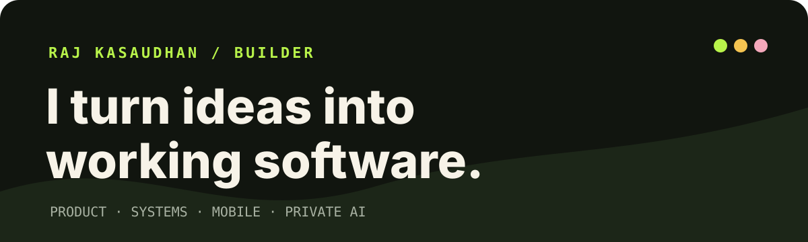
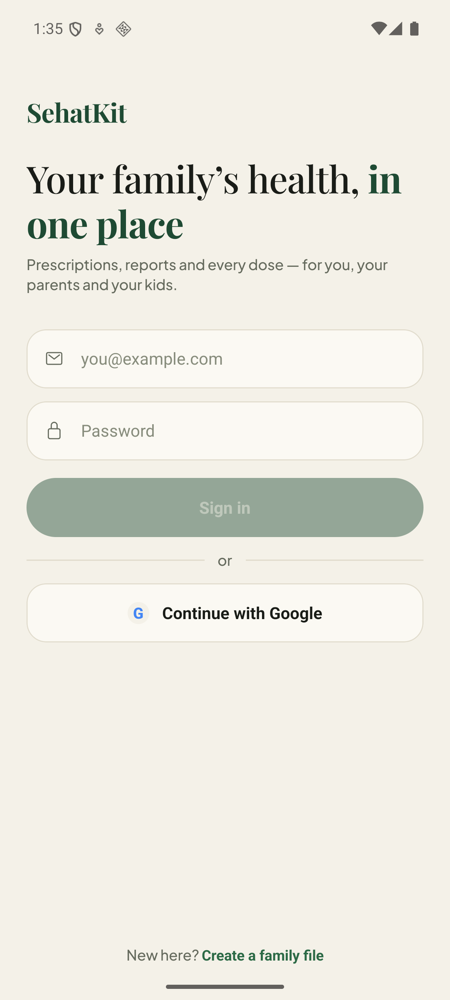
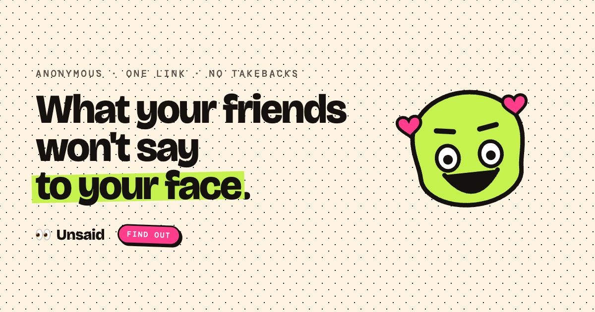

<p align="center">
  
</p>

<p align="center">
  <a href="https://www.rajkasaudhan.com.np"></a>
  <a href="https://www.linkedin.com/in/raj-kasaudhan"></a>
  <a href="mailto:develop@rajkasaudhan.com.np"></a>
</p>

I build products end to end: the interface, the backend, the awkward device integration, and the path to production. My recent work sits where **mobile, private AI, and operational software** meet.

I care about the seams that demos skip: models that actually run on-device, state transitions that survive races, tenant boundaries enforced by the backend, and deployments someone can operate after launch.

### What I am building now

<table>
  <tr>
    <td width="50%" valign="top">
      
    </td>
    <td width="50%" valign="top">
      <h3>Biofe</h3>
      <p>A quiet, private journal that turns writing and voice notes into useful structure: mood patterns, goals, reminders, and reflection.</p>
      <p>I am building its web and mobile systems, including offline Whisper transcription, on-device reminder extraction with Qwen, native home-screen widgets, sharing, auth, and a Cloudflare-hosted API.</p>
      <p><code>Flutter</code> <code>Riverpod</code> <code>Next.js</code> <code>Firebase</code> <code>Cloudflare</code> <code>MongoDB</code></p>
      <sub>Private build · screenshot uses sample content</sub>
    </td>
  </tr>
  <tr>
    <td width="50%" valign="top">
      <h3>SehatKit</h3>
      <p>A family medical-record app for prescriptions, reports, medicines, reminders, and lab trends.</p>
      <p>The core promise is privacy: OCR, clinical entity extraction, and identity redaction are designed to run on the phone. Families can organise care and share a useful record without casually leaking personal details.</p>
      <p><code>React Native</code> <code>Expo</code> <code>ONNX Runtime</code> <code>ML Kit</code> <code>Firebase</code></p>
      <sub>Private build · screenshot contains no personal data</sub>
    </td>
    <td width="50%" valign="top">
      
    </td>
  </tr>
</table>

<p align="center">
  
</p>

#### Unsaid

An anonymous feedback game built around one shareable link and one final AI verdict. Friends answer without accounts; results unlock only after a threshold and freeze when the round ends. The backend uses HMAC-scoped device identity, atomic Redis duplicate protection, guarded state transitions, and real Postgres/Redis integration tests.

`Rust` `Axum` `React 19` `TypeScript` `PostgreSQL` `Redis` `Gemini` · Private build

### Selected public work

| Project | What it does | Engineering focus |
|---|---|---|
| [wirestat](https://github.com/rajksd01/wirestat) | Adds one readable HTTP timing line to every interactive `curl` call | Shell portability, zero output contamination, protocol and connection timing |
| [Sathi / dukaan](https://github.com/rajksd01/dukaan) | AI sales agent and storefront for Nepali shops: product discovery, baskets, COD orders, CRM, and insights | Gemini, multilingual commerce flows, Express, SQLite, embeddable widget |
| [Byapar](https://github.com/rajksd01/byapar) | Wholesale ordering for sellers and retailers using catalog sharing, chat, negotiation, and push updates | Expo, React Native, Express, MongoDB, Firebase Cloud Messaging |

### Systems I have taken from idea to working software

- **Setu / Admitly:** multi-tenant education consultancy CRM with lead workflows, follow-ups, role-based access, tenant isolation, a Rust/Axum API, and Postgres.
- **Restro:** QR table ordering plus restaurant operations across kitchen, billing, staff, inventory, purchasing, recipes, shifts, and customer credit.
- **Samajh:** an Android-first, one-tap Hindi screen translation concept using accessibility nodes, on-device translation, and overlays, designed around parents who cannot navigate English-only apps.
- **Production engineering:** TypeScript product surfaces, Python AI/vision services, deployment automation, CI/CD, observability, and the operational work around them.

### How I build

```text
find the real user loop
→ make the smallest useful product
→ test the failure-prone boundaries
→ ship it somewhere real
→ watch what breaks
→ improve the loop
```

My current toolbox includes TypeScript, React, React Native, Flutter, Rust, Python, Node.js, PostgreSQL, MongoDB, Redis, Firebase, Docker, Cloudflare, and practical on-device ML. The tool is secondary; I pick the stack that makes the product easier to finish and operate.

Most of my current activity is in private repositories. GitHub includes those contributions anonymously in the contribution graph on this profile, without exposing private code or repository names.

<p align="center">
  <strong>Building from Bangalore, for people whose problems rarely fit inside a polished demo.</strong><br />
  <a href="mailto:develop@rajkasaudhan.com.np">develop@rajkasaudhan.com.np</a>
</p>
