

  

<h1 align="center">I take products from idea to production. Fast.</h1>

  <strong>Raj Kasaudhan</strong> · Software engineer and builder · Bangalore, India

  I build mobile apps, web apps, Rust services, multi-tenant backends, and on-device AI.
  The whole product, not one slice of it.

  <strong>Engineer is the training. Builder is the habit.</strong> 
  <strong>Obsessed with shipping.</strong> Ideas are cheap. A link you can open is not.

  Nine products built. Several are live and linked below.

  <a href="https://www.rajkasaudhan.com.np"><strong>Portfolio</strong></a>
  &nbsp;·&nbsp;
  <a href="https://www.linkedin.com/in/raj-kasaudhan"><strong>LinkedIn</strong></a>
  &nbsp;·&nbsp;
  <a href="https://mail.google.com/mail/?view=cm&amp;fs=1&amp;to=iamrajkasaudhan@gmail.com"><strong>Email me</strong></a>
  &nbsp;·&nbsp;
  <a href="https://github.com/rajksd01?tab=repositories"><strong>All repositories</strong></a>

  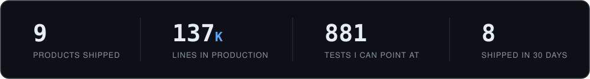

## Proof of work

### Biofe · a private journal that turns thoughts into action

<table>
  <tr>
    <td width="50%"><a href="https://biofe-v2.vercel.app">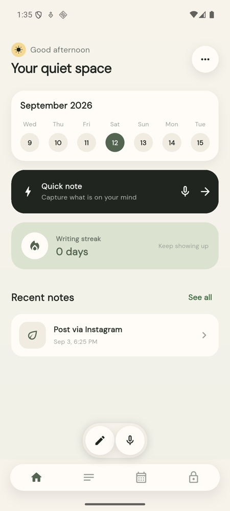</a></td>
    <td width="50%"><a href="https://biofe-v2.vercel.app">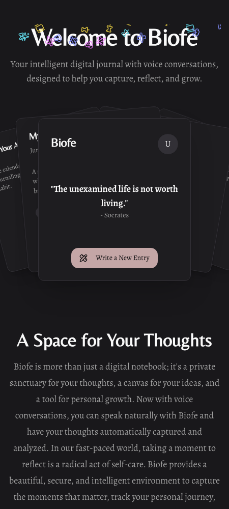</a></td>
  </tr>
</table>

Writing and voice notes become mood patterns, goals, reminders, and reflection worth reading back.

**The hard part:** transcription and meaning extraction run on the user's device, so a private journal never leaves it. Mobile app, responsive web, and deployed API are all mine.

`Flutter` `Riverpod` `Next.js` `Firebase` `Cloudflare` `MongoDB` `Whisper` `Qwen` · 46K lines · **[Open live product ↗](https://biofe-v2.vercel.app)**

 

### Unsaid · anonymous feedback with one final verdict

<table>
  <tr>
    <td width="50%"><a href="https://unsaid-sable.vercel.app">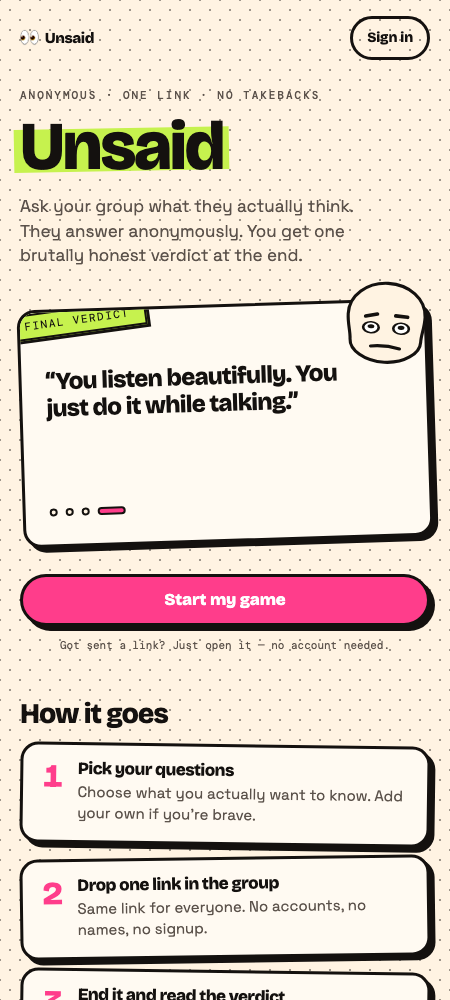</a></td>
    <td width="50%"><a href="https://unsaid-sable.vercel.app">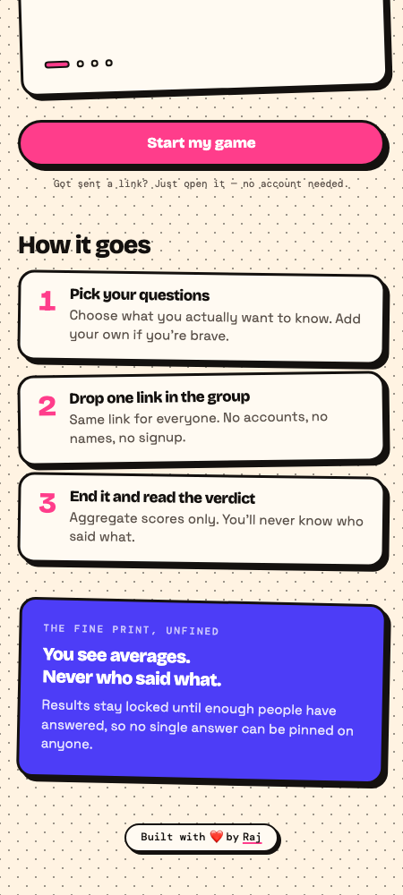</a></td>
  </tr>
</table>

Friends answer from one link with no accounts. Enough answers unlock a shareable AI verdict.

**The hard part:** anonymity and one-vote-per-person are opposite requirements. The Rust service solves it with private device identity, atomic duplicate protection, and guarded game states, covered by 101 concurrency tests.

`Rust` `Axum` `React 19` `TypeScript` `PostgreSQL` `Redis` `Gemini` · **101 tests** · **[Play Unsaid ↗](https://unsaid-sable.vercel.app)**

 

### SehatKit · private family health records that stay useful

<table>
  <tr>
    <td width="50%">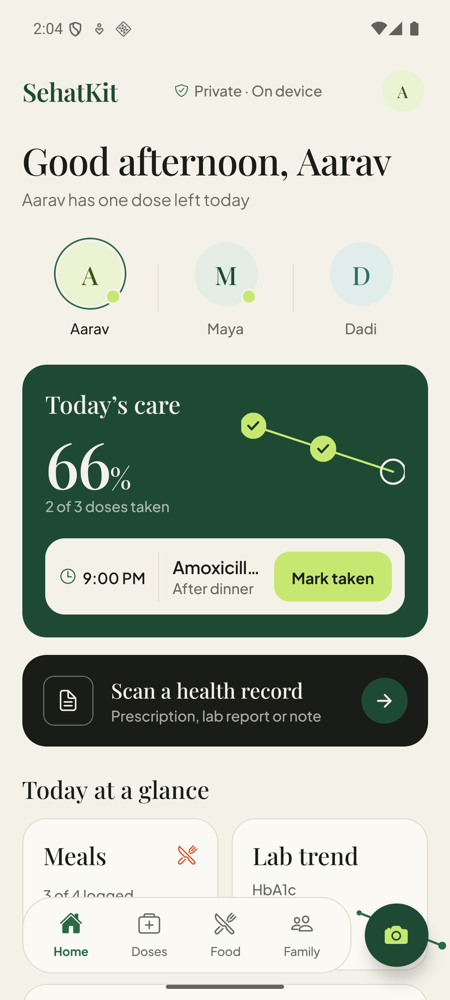</td>
    <td width="50%">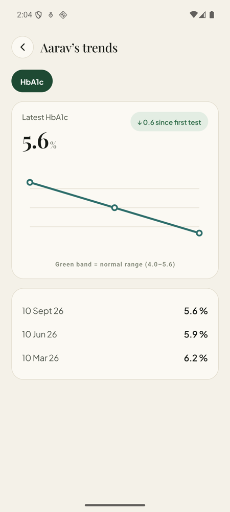</td>
  </tr>
</table>

Prescriptions, reports, medicines, reminders, meals, family timelines, and lab trends in one app.

**The hard part:** health data cannot be shipped to a cloud model for parsing. OCR, clinical entity extraction, and identity redaction all run on the phone. Every record pictured is fictional demo data.

`React Native` `Expo` `TypeScript` `ONNX Runtime` `ML Kit` `Firebase` `on-device NLP`

 

### Sathi / Dukaan · an AI salesperson for Nepali shops

<table>
  <tr>
    <td width="50%">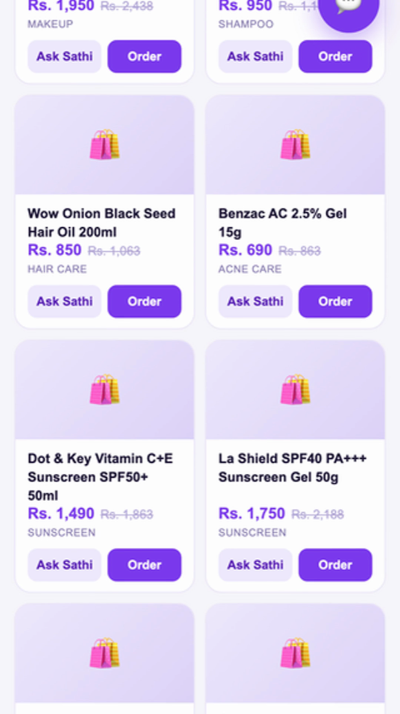</td>
    <td width="50%">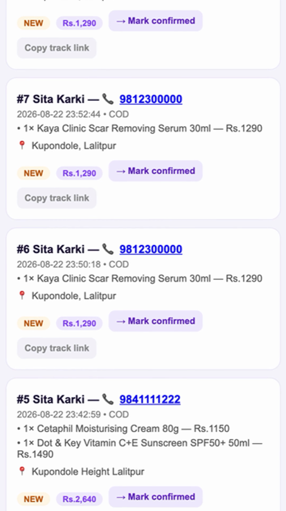</td>
  </tr>
</table>

Sathi builds the storefront, sells in Nepali conversation, recommends products, fills the basket, takes cash-on-delivery orders, and hands the shopkeeper an operations view.

**The hard part:** the shopkeeper never writes a product description or a reply. The model does the selling and the merchant only sees orders.

`Gemini` `Node.js` `Express` `SQLite` `multilingual commerce` `embeddable widget`

 

### Byapar · wholesale ordering built for the local workflow

<table>
  <tr>
    <td width="50%">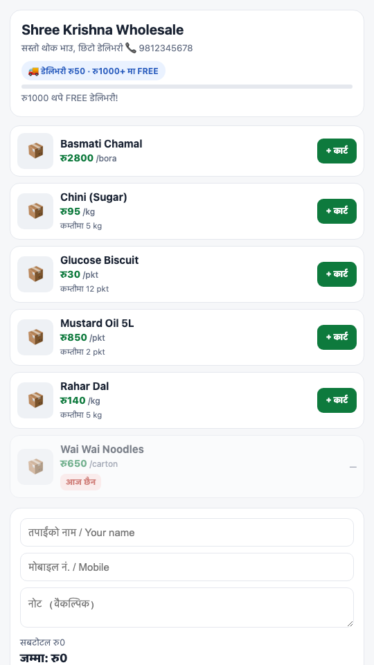</td>
    <td width="50%">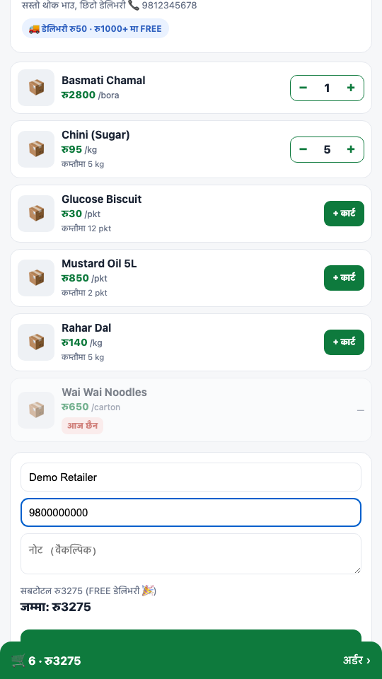</td>
  </tr>
</table>

Sellers publish price lists. Retailers browse, build wholesale quantities, order, negotiate in chat, and get status updates.

**The hard part:** retailers will not install an app to place one order, so the whole buying flow works from a link while the seller keeps a native app.

`React Native` `Expo` `Node.js` `MongoDB` `FCM` `Cloudflare`

## More systems I have shipped

- **Restro** — restaurant operating system: QR ordering, kitchen, billing, staff, inventory, purchasing, recipes, shifts, customer credit. 39K lines, 780 test cases.
- **Setu / Admitly** — multi-tenant education CRM with leads, follow-ups, RBAC, and hard tenant isolation on Rust, Axum, and Postgres.
- **Samajh** — one-tap Hindi screen translation on Android using accessibility nodes, on-device translation, and overlays.
- **[wirestat](https://github.com/rajksd01/wirestat)** — readable HTTP timing on every interactive `curl` call without contaminating command output.

  
<strong>Earlier products, experiments, and backend builds</strong>

   

- **Expense Tracker** — [API](https://github.com/rajksd01/expenseTracker) · [Web client](https://github.com/rajksd01/ExpenseTrackerWeb)
- **URL Shortener** — [Backend](https://github.com/rajksd01/urlShortner) · [Frontend](https://github.com/rajksd01/urlShortnerFrontend)
- **Netflix UI Clone** — [Demo](https://netflix-ui-clone-lemon.vercel.app) · [Code](https://github.com/rajksd01/Netflix-UI-Clone)
- **Blogging App** — [Live demo](https://blogging-app-self.vercel.app) · [Code](https://github.com/rajksd01/bloggingApp)
- **Flight booking system** — [Core API](https://github.com/rajksd01/flightBookingBackend) · [Gateway](https://github.com/rajksd01/FlightAPI_Gateway) · [Booking](https://github.com/rajksd01/bookingService) · [Notifications](https://github.com/rajksd01/NotificationService)
- **DALL·E Clone** — [Code](https://github.com/rajksd01/dalle-clone) · **Hotel Booking** — [Code](https://github.com/rajksd01/HotelBooking)
- **API Collection** — [Live demo](https://api-collection.netlify.app/) · [Code](https://github.com/rajksd01/api-collection)
- **Community builds** — [GDSC FETJU](https://github.com/rajksd01/gdsc-website) · [EERC](https://github.com/rajksd01/EERC-Final) · [Dashboard backend](https://github.com/rajksd01/DashBoardBackend) / [frontend](https://github.com/rajksd01/DashBoardFrontend)

## How I work

  

**Ship first, then harden.** Something real goes live in week one. Opinions about it are worth more than opinions about a document.

**Tests where state and money live.** Not coverage theatre. Unsaid has 101 tests because two people can answer the same question at the same millisecond. Restro has 780 because a bill must never be wrong.

**Privacy as an engineering constraint.** Health records, journals, and identity documents get parsed on the user's device. It costs more effort and it removes an entire class of risk from your company.

**I pick the boring option on purpose.** Clever architecture is what somebody decodes at 3am during an outage. I reach for the smallest thing that holds, and spend the saved time on the part users actually touch.

## Work with me

| You need | What you get |
| --- | --- |
| **Zero to one** | A real product in users' hands in weeks, not a slide about one. |
| **An AI feature that actually works** | On-device or hosted, wired into your product, evaluated, not demoed once. |
| **A stalled build rescued** | I read the codebase, find what is actually blocking, and ship the next release. |

<b>&rsaquo;&nbsp;&nbsp;what week one actually looks like</b>

 

| Day | What happens |
| --- | --- |
| **1** | I read your product and your code. No meetings. |
| **2** | We agree on the one thing that should exist by Friday. |
| **3 – 4** | I build it. You get a link every evening, not a status update. |
| **5** | It is live. We pick week two. |

Based in Bangalore, working with teams anywhere. Open to ambitious products, strong teams, and founder conversations.

  <a href="https://mail.google.com/mail/?view=cm&amp;fs=1&amp;to=iamrajkasaudhan@gmail.com"><strong>Start a conversation ↗</strong></a>

## What I build with

**Languages** · TypeScript, JavaScript, Rust, Python, Dart, Java, C, C++, SQL, PHP, HTML, CSS 
**Products** · React, Next.js, React Native, Expo, Flutter, Angular, Tailwind CSS, Bootstrap, WordPress 
**Backend & data** · Node.js, Express, Axum, PostgreSQL, MongoDB, MySQL, Redis, Prisma, RabbitMQ 
**AI** · Gemini, Qwen, Whisper, ONNX Runtime, ML Kit, OCR, RAG, NLP, computer vision 
**Infrastructure** · Docker, AWS, Cloudflare, Firebase, GitHub Actions, Linux, Vercel, CI/CD 
**Also used** · Postman, NumPy, Pandas, Power BI, Arduino, MATLAB, Git

## GitHub activity

  <a href="https://github.com/rajksd01?tab=overview">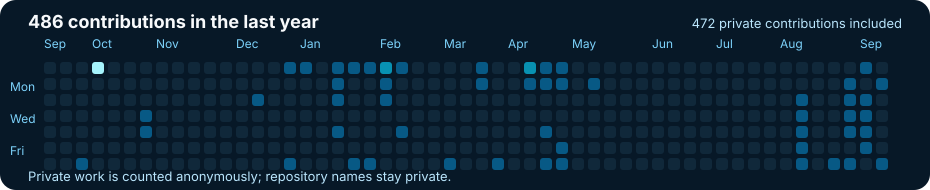</a>

  <a href="https://mail.google.com/mail/?view=cm&amp;fs=1&amp;to=iamrajkasaudhan@gmail.com"><strong>iamrajkasaudhan@gmail.com</strong></a>
  &nbsp;·&nbsp;
  <a href="https://www.linkedin.com/in/raj-kasaudhan">LinkedIn</a>
  &nbsp;·&nbsp;
  <a href="https://www.rajkasaudhan.com.np">Portfolio</a>

<b>&rsaquo;&nbsp;&nbsp;you scrolled all the way down</b>

 

So did I, on every product up there, at 2am, wondering why the build went red.

If you are building something and need a second pair of hands that actually ships, the email is a few lines up.

