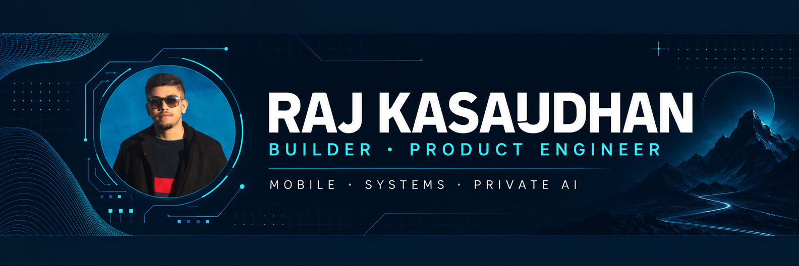
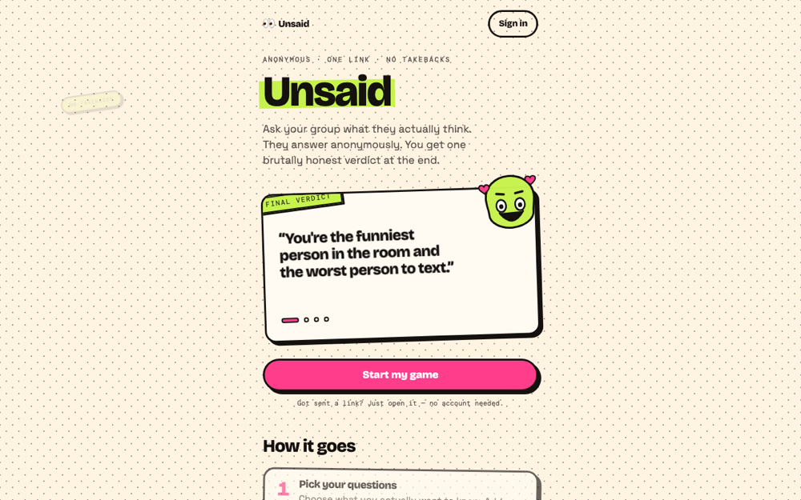
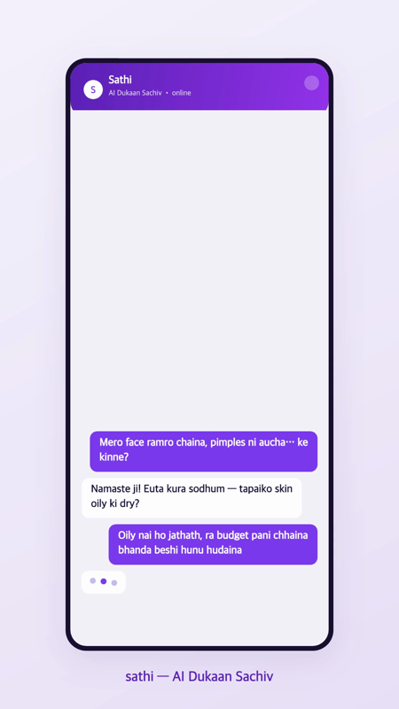
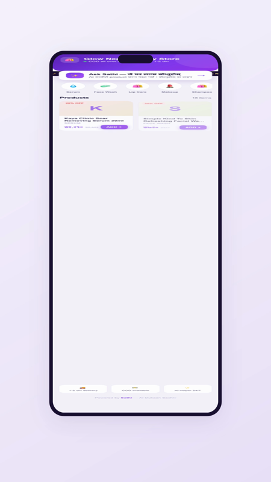
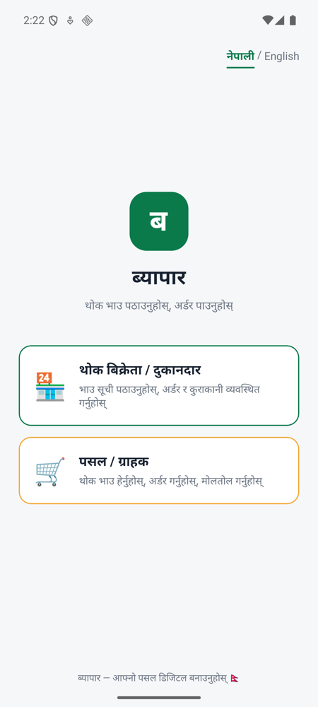

  

  
  
  
  

<h2 align="center">I build the whole product.</h2>

  Mobile client, product UI, API, database, local AI, deployment, and the awkward edges that make software survive real users.
  My recent work sits where <strong>mobile, private AI, and operational systems</strong> meet.

  <strong>Looking for a product engineer, a technical collaborator, or a cofounder who can turn a messy idea into working software?</strong> 
  <a href="mailto:iamrajkasaudhan@gmail.com">Tell me what you are building →</a>

## Proof of work

<table>
  <tr>
    <td width="42%" valign="top">
      
    </td>
    <td width="58%" valign="top">
      <h3>Biofe — a private journal that does something with your thoughts</h3>
      
Writing and voice notes become mood patterns, goals, reminders, and useful reflection. I built across the web and mobile product: offline Whisper transcription, on-device Qwen extraction, widgets, sharing, auth, and the deployed API.

      
<strong>Why it is interesting:</strong> useful AI without sending a personal journal to a model on every interaction.

      
<code>Flutter</code> <code>Riverpod</code> <code>Next.js</code> <code>Firebase</code> <code>Cloudflare</code> <code>MongoDB</code> <code>Whisper</code> <code>Qwen</code>

      
<a href="https://biofe-v2.vercel.app"><strong>Open web demo ↗</strong></a>

    </td>
  </tr>
</table>

<table>
  <tr>
    <td width="50%" valign="top">
      
    </td>
    <td width="50%" valign="top">
      
    </td>
  </tr>
</table>

### SehatKit — family health records that stay useful and private

Prescriptions, reports, medicines, reminders, meals, family timelines, and lab trends in one mobile app. OCR, clinical entity extraction, and identity redaction are designed to run on the phone. The screens above use fictional family and medical records.

<code>React Native</code> <code>Expo</code> <code>TypeScript</code> <code>ONNX Runtime</code> <code>ML Kit</code> <code>Firebase</code> <code>on-device NLP</code>

  

### Unsaid — one anonymous link, one final verdict

Friends answer without accounts. Results remain locked until enough people respond; ending a round freezes it permanently and produces one shareable AI verdict. Under the playful UI is a Rust service with HMAC-scoped device identity, atomic Redis duplicate protection, guarded state transitions, Postgres persistence, and real concurrency tests.

<code>Rust</code> <code>Axum</code> <code>React 19</code> <code>TypeScript</code> <code>PostgreSQL</code> <code>Redis</code> <code>Gemini</code> · <strong>101 tests</strong>

**[Play Unsaid ↗](https://unsaid-sable.vercel.app)**

<table>
  <tr>
    <td width="50%" valign="top">
      
    </td>
    <td width="50%" valign="top">
      
    </td>
  </tr>
  <tr>
    <td colspan="2" valign="top">
      <h3><a href="https://github.com/rajksd01/dukaan">Sathi / Dukaan</a> — an AI salesperson for Nepali shops</h3>
      
Creates a storefront, answers shoppers in Nepali, recommends products, builds baskets, accepts COD orders, and gives the seller CRM and sales insight. It is designed around how local commerce already works: conversation first.

      
<code>Gemini</code> <code>Node.js</code> <code>Express</code> <code>SQLite</code> <code>multilingual commerce</code> <code>embeddable widget</code>

    </td>
  </tr>
</table>

<table>
  <tr>
    <td width="42%" valign="top">
      
    </td>
    <td width="58%" valign="top">
      <h3><a href="https://github.com/rajksd01/byapar">Byapar</a> — wholesale ordering built for the local workflow</h3>
      
Sellers maintain a catalog and share price lists. Retailers browse, order, negotiate in chat, and receive status updates. The bilingual interface is built for Nepali wholesalers and tier-2/3 Indian markets.

      
<code>React Native</code> <code>Expo</code> <code>Node.js</code> <code>MongoDB</code> <code>FCM</code> <code>Cloudflare</code>

      
<a href="https://github.com/rajksd01/byapar"><strong>Read the architecture ↗</strong></a>

    </td>
  </tr>
</table>

## More systems I have built

| Product | What I owned |
|---|---|
| **Setu / Admitly** | Multi-tenant education consultancy CRM: leads, follow-ups, RBAC, tenant isolation, Rust/Axum API, and Postgres |
| **Restro** | QR ordering plus kitchen, billing, staff, inventory, purchasing, recipes, shifts, and customer credit |
| **Samajh** | One-tap Hindi screen translation for Android using accessibility nodes, on-device translation, and overlays |
| [**wirestat**](https://github.com/rajksd01/wirestat) | A shell tool that adds one readable HTTP timing line to every interactive curl call without contaminating output |

## The path here

The smaller products taught me to ship. The current products taught me to design systems around privacy, race conditions, device limits, unreliable networks, and real operating workflows.

  
<strong>Web products, experiments, and earlier builds</strong>

   

| Project | Links |
|---|---|
| Expense Tracker | [API](https://github.com/rajksd01/expenseTracker) · [Web client](https://github.com/rajksd01/ExpenseTrackerWeb) |
| URL Shortener | [Backend](https://github.com/rajksd01/urlShortner) · [Frontend](https://github.com/rajksd01/urlShortnerFrontend) |
| Netflix UI Clone | [Demo](https://netflix-ui-clone-lemon.vercel.app) · [Code](https://github.com/rajksd01/Netflix-UI-Clone) |
| Blogging App | [Live demo](https://blogging-app-self.vercel.app) · [Code](https://github.com/rajksd01/bloggingApp) |
| Flight booking services | [Core API](https://github.com/rajksd01/flightBookingBackend) · [Gateway](https://github.com/rajksd01/FlightAPI_Gateway) · [Booking](https://github.com/rajksd01/bookingService) · [Notifications](https://github.com/rajksd01/NotificationService) |
| DALL·E Clone | [Code](https://github.com/rajksd01/dalle-clone) |
| Hotel Booking | [Code](https://github.com/rajksd01/HotelBooking) |
| API Collection | [Live demo](https://api-collection.netlify.app/) · [Code](https://github.com/rajksd01/api-collection) |
| GDSC FETJU | [Code](https://github.com/rajksd01/gdsc-website) |
| EERC | [Code](https://github.com/rajksd01/EERC-Final) |
| Dashboard | [Backend](https://github.com/rajksd01/DashBoardBackend) · [Frontend](https://github.com/rajksd01/DashBoardFrontend) |

**[Browse all repositories →](https://github.com/rajksd01?tab=repositories)**

## Stack I can build with

| Layer | Tools |
|---|---|
| **Languages** | TypeScript, JavaScript, Rust, Python, Dart, Java, C, C++, SQL, PHP, HTML, CSS |
| **Product surfaces** | React, Next.js, React Native, Expo, Flutter, Angular, Tailwind CSS, Bootstrap, WordPress |
| **Backend & data** | Node.js, Express, Axum, PostgreSQL, MongoDB, MySQL, Redis, Prisma, RabbitMQ |
| **AI & on-device** | Gemini, Qwen, Whisper, ONNX Runtime, ML Kit, OCR, RAG, NLP, computer vision |
| **Infra & delivery** | Docker, AWS, Cloudflare, Firebase, GitHub Actions, Linux, Vercel, CI/CD |
| **Also used** | Postman, NumPy, Pandas, Power BI, Arduino, MATLAB, Git |

## How I work

<pre>
find the real user loop
→ build the smallest useful product
→ test the boundaries most likely to fail
→ ship it somewhere real
→ watch what breaks
→ improve the loop
</pre>

## GitHub activity

Most of my current engineering happens in private repositories. GitHub is configured to count those contributions anonymously in the native contribution calendar on this profile, without exposing private code or repository names.

  

  
  

  <strong>Bangalore · open to ambitious products, strong teams, and founder conversations</strong>  
  <a href="mailto:iamrajkasaudhan@gmail.com"><strong>iamrajkasaudhan@gmail.com</strong></a>
  &nbsp;·&nbsp;
  <a href="https://www.linkedin.com/in/raj-kasaudhan">LinkedIn</a>
  &nbsp;·&nbsp;
  <a href="https://www.rajkasaudhan.com.np">Portfolio</a>

